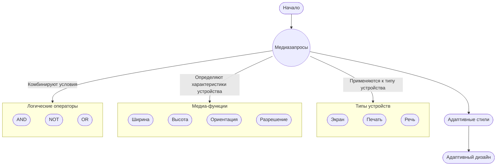

```mermaid
flowchart TD
    Start([Начало]) --> MediaQueries((Медиазапросы))
    
    subgraph DeviceTypes [Типы устройств]
        direction TB
        Screen([Экран])
        Print([Печать])
        Speech([Речь])
    end
    
    subgraph MediaFeatures [Медиа-функции]
        direction TB
        Width([Ширина])
        Height([Высота])
        Orientation([Ориентация])
        Resolution([Разрешение])
    end
    
    subgraph LogicalOperators [Логические операторы]
        direction TB
        And([AND])
        Not([NOT])
        Comma([OR])
    end
    
    MediaQueries -->|Применяются к типу устройства|DeviceTypes
    MediaQueries -->|Определяют характеристики устройства|MediaFeatures
    MediaQueries -->|Комбинируют условия|LogicalOperators
    
    MediaQueries --> AdaptiveStyles([Адаптивные стили])
    
    AdaptiveStyles --> ResponsiveDesign([Адаптивный дизайн])
```